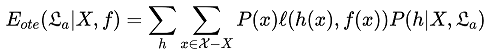
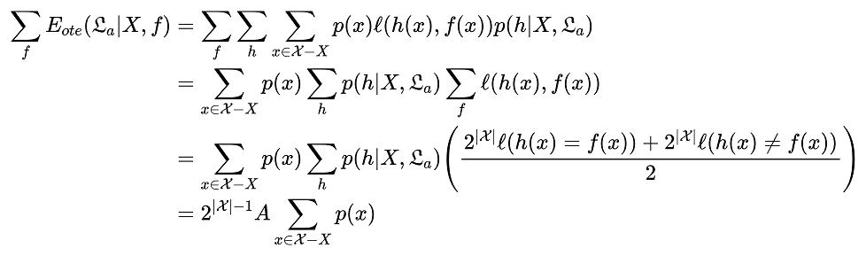

# 周志华《机器学习》第1章课后习题

1. 试给出下列两个样例的版本空间：

   | 编号 | 色泽 | 根蒂 | 敲声 | 好瓜 |
   | :--: | :--: | :--: | :--: | :--: |
   |  1   | 青绿 | 蜷缩 | 浊响 |  是  |
   |  4   | 乌黑 | 稍蜷 | 沉闷 |  否  |

   > ```mermaid
   > graph BT
   >   色泽=青绿,根蒂=蜷缩,敲声=浊响 --> 色泽=*,根蒂=蜷缩,敲声=浊响
   >   色泽=青绿,根蒂=蜷缩,敲声=浊响 --> 色泽=青绿,根蒂=*,敲声=浊响
   >   色泽=青绿,根蒂=蜷缩,敲声=浊响 --> 色泽=青绿,根蒂=蜷缩,敲声=*
   >   色泽=青绿,根蒂=蜷缩,敲声=* --> 色泽=*,根蒂=蜷缩,敲声=*
   >   色泽=青绿,根蒂=蜷缩,敲声=* --> 色泽=青绿,根蒂=*,敲声=*
   >   色泽=青绿,根蒂=*,敲声=浊响 --> 色泽=*,根蒂=*,敲声=浊响
   >   色泽=青绿,根蒂=*,敲声=浊响 --> 色泽=青绿,根蒂=*,敲声=*
   >   色泽=*,根蒂=蜷缩,敲声=浊响 --> 色泽=*,根蒂=*,敲声=浊响
   >   色泽=*,根蒂=蜷缩,敲声=浊响 --> 色泽=*,根蒂=蜷缩,敲声=*
   > ```

2. 与使用单个合取式来进行假设表示相比，使用『析合范式』将使得假设空间具有更强的表示能力。若使用最多包含$k$个合取式的析合范式来表达表1.1西瓜分类问题的假设空间，试估算共有多少种可能的假设。

   | 编号 | 色泽 | 根蒂 | 敲声 | 好瓜 |
   | :--: | :--: | :--: | :--: | :--: |
   |  1   | 青绿 | 蜷缩 | 浊响 |  是  |
   |  2   | 乌黑 | 蜷缩 | 浊响 |  是  |
   |  3   | 青绿 | 硬挺 | 清脆 |  否  |
   |  4   | 乌黑 | 稍蜷 | 沉闷 |  否  |

   > 所有的可能总数小于 $2^{18}$ 种，具体算法可参考 CSDN 中 [@是你的小鱼](https://blog.csdn.net/yuzeyuan12/article/details/83113461) 的答案。

3. 若数据包含噪声，则假设空间中有可能不存在与所有训练样本都一致的假设。在此情形下，试设计一种归纳偏好用于假设选择。

   > 当数据中包含噪声的时候，首选方法是去噪。当存在属性相同但标签不同的样例时，只保留其中一种标签（例如仅保留正例）的样例，在此基础上生成版本空间。
   >
   > 我们还可以选择以下2种方法生成版本空间：
   >
   > 1. 仅剔除与反例冲突的假设。
   > 2. 仅保留符合所有正例的假设。

4. 本章第 1.4 节在论述『没有免费的午餐定理』时，默认使用了『分类错误率』作为性能度量来对分类器进行评估。若换用其他性能度量 $\ell$ ，则式（1.1）将改为

   
   
   试证明『没有免费的午餐定理』仍然成立。
   
   > 构造引理：在二分类问题下，对任意性能度量指标 $\ell$ ，$\ell(h(x)=(x))+\ell(h(x)\neq f(x))=A$ ，$A$ 为某一常数。
   >
   > 证明：对于二分类问题，任意性能度量中的正确分类得分与错误分类得分应该是固定的。即
   > 
   > 
   > 
   > 因此，
   > 
   > $$
   > \ell(0,0)+\ell(0,1)=\ell(1,1)+\ell(1,0)
   > $$
   > 
   > 设上式的值为 $A$ ，则
   > 
   > $$
   > \ell(h(x)=(x))+\ell(h(x)\neq f(x))=A
   > $$
   > 
   > 随后，证明定理
   > 
   > 
   > 
   > 以上计算结果与学习算法 $\mathfrak{L}_a$ 无关，定理仍然成立。
   
5. 试述机器学习能在互联网搜索的哪些环节起什么作用。

   > 1. 在用户搜索过程中，我们可以获取用户搜索时使用的关键词，经机器学习（模式挖掘）获得关键词前缀与完整关键词的关联关系，根据关键词热度提供基于前缀的关键词补全功能。
   > 2. 通过机器学习（协同过滤），我们可以获得用户与其搜索的关键词之间的潜在联系，以用户为本、提供基于用户的搜索热词推荐。
   > 3. 通过机器学习（自然语言处理），能够从复杂的文本正文中提取信息，生成摘要并进行后续语义分析。

